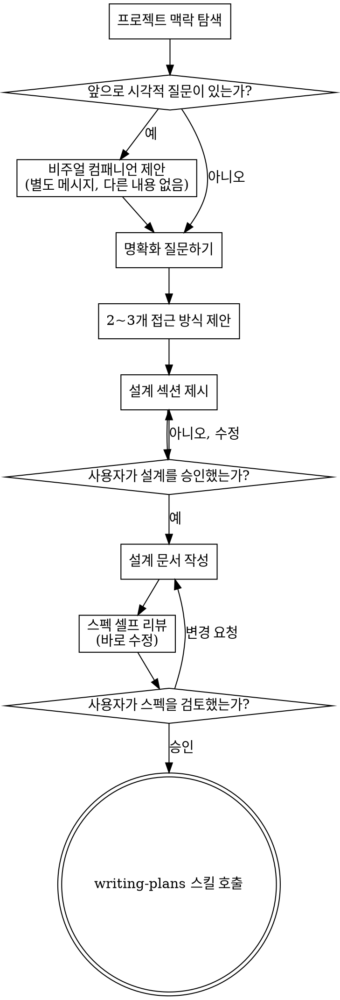

# 아이디어를 설계로 구체화하기

자연스럽고 협업적인 대화를 통해 아이디어를 충분히 다듬어진 설계와 스펙으로 발전시키도록 돕는다.

먼저 현재 프로젝트의 맥락을 이해한 다음, 질문을 한 번에 하나씩 하며 아이디어를 정교하게 만든다. 무엇을 만들려는지 이해하게 되면 설계를 제시하고 사용자 승인을 받는다.

<HARD-GATE>
설계를 제시하고 사용자가 승인하기 전까지는 어떤 구현 스킬도 호출하지 말고, 코드를 작성하지 말고, 프로젝트를 스캐폴딩하지 말고, 그 어떤 구현 행동도 하지 마라.
</HARD-GATE>

설계의 깊이는 작업의 복잡도에 맞아야 한다. 설정 변경은 한 줄 설명이면 충분할 수 있고, 새로운 기능은 전체 스펙이 필요하다. 하지만 언제나 구현 전에 설계를 제시하고 승인을 받아야 한다.

## 체크리스트

다음 각 항목에 대해 반드시 todo를 만들고, 순서대로 완료해야 한다:

1. **프로젝트 맥락 탐색** — 파일, 문서, 최근 커밋 확인
2. **비주얼 컴패니언 제안** (주제가 시각적 질문을 포함할 경우) — 이것은 별도 메시지여야 하며, 명확화 질문과 합치면 안 된다. 아래 Visual Companion 섹션을 참고한다.
3. **명확화 질문하기** — 한 번에 하나씩, 목적/제약/성공 기준을 이해한다
4. **2~3개의 접근 방식 제안** — 트레이드오프와 추천안 포함
5. **설계 제시** — 복잡도에 맞는 섹션 단위로 제시하고, 각 섹션 뒤에 사용자 승인을 받는다
6. **설계 문서 작성** — `docs/specs/YYYY-MM-DD-<topic>-design.md`에 저장하고 커밋한다
7. **스펙 셀프 리뷰** — 플레이스홀더, 모순, 모호함, 범위를 빠르게 점검한다(아래 참고)
8. **사용자가 작성된 스펙 검토** — 다음 단계로 진행하기 전에 사용자가 스펙 파일을 검토하도록 요청한다
9. **구현 단계로 전환** — 구현 계획을 만들기 위해 writing-plans 스킬을 호출한다

## 진행 흐름

**최종 상태는 writing-plans 호출이다.** frontend-design, mcp-builder, 또는 다른 구현 스킬을 호출하지 마라. brainstorming 다음에 호출할 수 있는 유일한 스킬은 writing-plans이다.

## 진행 방식

**아이디어 이해하기:**

- 먼저 현재 프로젝트 상태를 확인한다(파일, 문서, 최근 커밋)
- 자세한 질문을 하기 전에 범위를 판단한다. 요청이 여러 개의 독립적인 서브시스템을 설명한다면(예: "채팅, 파일 저장, 결제, 분석이 포함된 플랫폼 만들기"), 이를 즉시 지적한다. 먼저 분해가 필요한 프로젝트의 세부사항을 질문으로 다듬는 데 시간을 쓰지 마라.
- 프로젝트가 하나의 스펙으로 담기엔 너무 크다면, 사용자가 이를 하위 프로젝트로 분해하도록 돕는다. 독립적인 구성요소가 무엇인지, 서로 어떻게 연결되는지, 어떤 순서로 만들어야 하는지 정리한다. 그 다음 첫 번째 하위 프로젝트에 대해 일반적인 설계 흐름으로 brainstorming을 진행한다. 각 하위 프로젝트는 각자의 스펙 -> 계획 -> 구현 사이클을 가져야 한다.
- 범위가 적절한 프로젝트라면, 질문을 한 번에 하나씩 하며 아이디어를 정교하게 만든다
- 가능하면 객관식 질문을 선호하되, 개방형 질문도 괜찮다
- 메시지당 질문은 하나만 한다. 더 탐색이 필요한 주제라면 여러 질문으로 나눈다
- 목적, 제약 조건, 성공 기준을 이해하는 데 집중한다

**접근 방식 탐색:**

- 트레이드오프와 함께 2~3개의 서로 다른 접근 방식을 제안한다
- 대화체로 옵션을 제시하되, 추천안과 그 이유를 함께 설명한다
- 먼저 가장 추천하는 옵션을 제시하고, 왜 그것을 추천하는지 설명한다

**설계 제시:**

- 무엇을 만들려는지 이해했다고 판단되면 설계를 제시한다
- 각 섹션은 복잡도에 맞게 조절한다. 단순하면 몇 문장으로, 섬세한 논의가 필요하면 200~300단어 정도까지 쓸 수 있다
- 각 섹션 뒤에 지금까지 맞는지 사용자에게 확인한다
- 다음 내용을 다룬다: 아키텍처, 구성요소, 데이터 흐름, 에러 처리, 테스트
- 무언가 말이 되지 않는다면 다시 돌아가 명확히 할 준비를 한다

**격리와 명확성을 위한 설계:**

- 시스템을, 각각 하나의 명확한 목적을 가지고, 잘 정의된 인터페이스를 통해 통신하며, 독립적으로 이해하고 테스트할 수 있는 더 작은 단위들로 나눈다
- 각 단위마다 다음 질문에 답할 수 있어야 한다: 무엇을 하는가, 어떻게 사용하는가, 무엇에 의존하는가?
- 어떤 단위가 내부 구현을 읽지 않고도 이해 가능한가? 내부를 바꿔도 소비자 코드가 깨지지 않는가? 그렇지 않다면 경계를 더 다듬어야 한다.
- 더 작고 경계가 분명한 단위는 작업하기도 쉽다. 한 번에 컨텍스트 안에 담을 수 있는 코드일수록 더 잘 추론할 수 있고, 파일이 집중되어 있을수록 수정의 신뢰성도 높아진다. 파일이 너무 커진다면 대개 너무 많은 일을 하고 있다는 신호다.

**기존 코드베이스에서 작업할 때:**

- 변경을 제안하기 전에 현재 구조를 탐색한다. 기존 패턴을 따른다.
- 기존 코드에 이 작업에 영향을 주는 문제가 있다면(예: 지나치게 커진 파일, 불명확한 경계, 얽힌 책임), 현재 목표를 수행하는 좋은 개발자처럼 설계의 일부로서 국소적인 개선을 포함한다.
- 관련 없는 리팩터링은 제안하지 마라. 현재 목표에 도움이 되는 범위에만 집중한다.

## 설계 이후

**문서화:**

- 검증된 설계(스펙)를 `docs/specs/YYYY-MM-DD-<topic>-design.md`에 작성한다
  - (스펙 위치에 대한 사용자 선호가 있다면 이 기본값보다 우선한다)
- 설계 문서를 git에 커밋한다

**스펙 셀프 리뷰:**
설계 문서를 작성한 뒤에는, 새로운 눈으로 다시 본다:

1. **플레이스홀더 점검:** "TBD", "TODO", 미완성 섹션, 모호한 요구사항이 있는가? 있으면 수정한다.
2. **내부 일관성:** 서로 모순되는 섹션이 있는가? 아키텍처가 기능 설명과 일치하는가?
3. **범위 점검:** 이것이 하나의 구현 계획으로 다루기에 충분히 집중된 범위인가, 아니면 분해가 필요한가?
4. **모호성 점검:** 어떤 요구사항이 두 가지 방식으로 해석될 수 있는가? 그렇다면 하나를 선택해 명시적으로 적는다.

문제가 있다면 바로 수정한다. 다시 검토할 필요는 없다. 고치고 계속 진행하면 된다.

**사용자 리뷰 게이트:**
스펙 리뷰 루프를 통과한 뒤에는, 다음 단계로 진행하기 전에 사용자가 작성된 스펙을 검토하도록 요청한다:

> "스펙을 작성하고 `<path>`에 커밋했습니다. 구현 계획 작성을 시작하기 전에 변경하고 싶은 점이 있는지 검토해 주세요."

사용자 응답을 기다린다. 변경 요청이 있다면 반영하고, 스펙 리뷰 루프를 다시 수행한다. 사용자가 승인한 뒤에만 다음으로 진행한다.

**구현:**

- `read`로 writing-plans SKILL.md를 불러오고, 이를 따라 상세한 구현 계획을 만든다
- 다른 스킬은 호출하지 마라. 다음 단계는 writing-plans이다.

## 핵심 원칙

- **질문은 한 번에 하나씩** - 여러 질문으로 압도하지 마라
- **객관식 선호** - 가능하다면 개방형 질문보다 답하기 쉽다
- **YAGNI를 철저히 적용** - 모든 설계에서 불필요한 기능을 제거한다
- **대안 탐색** - 결론을 내리기 전에 항상 2~3개의 접근 방식을 제안한다
- **점진적 검증** - 설계를 제시하고, 승인을 받은 뒤 다음으로 넘어간다
- **유연하게 대응** - 말이 되지 않는 부분이 있으면 다시 돌아가 명확히 한다

## 시각 보조 도구

브레인스토밍 중에 목업, 다이어그램, 시각적 옵션을 보여주기 위한 브라우저 기반 컴패니언이다. 하나의 모드가 아니라 도구로 제공된다. 컴패니언을 수락한다는 것은 시각적 표현이 도움이 되는 질문에서 사용할 수 있다는 뜻이지, 모든 질문을 브라우저로 처리한다는 뜻은 아니다.

**컴패니언 제안하기:** 앞으로의 질문에 시각적 콘텐츠(목업, 레이아웃, 다이어그램)가 포함될 것 같다면, 한 번만 동의를 구한다:
> "지금 함께 작업하는 내용 중 일부는 웹 브라우저에서 직접 보여드리면 더 설명하기 쉬울 수 있습니다. 진행하면서 목업, 다이어그램, 비교안, 그 밖의 시각 자료를 만들어 보여드릴 수 있어요. 이 기능은 아직 새롭고 토큰을 많이 사용할 수 있습니다. 사용해보시겠어요? (로컬 URL을 열어야 합니다)"

**이 제안은 반드시 별도 메시지여야 한다.** 명확화 질문, 컨텍스트 요약, 다른 어떤 내용과도 합치지 마라. 메시지에는 위 제안 문구만 들어 있어야 하며 그 외 내용은 없어야 한다. 계속 진행하기 전에 사용자 응답을 기다린다. 사용자가 거절하면 텍스트만으로 brainstorming을 진행한다.

**질문별 판단:** 사용자가 수락한 뒤에도, 각 질문마다 브라우저를 쓸지 터미널을 쓸지 결정해야 한다. 기준은 이것이다: **사용자가 읽는 것보다 보는 것이 더 이해하기 쉬운가?**

- **브라우저 사용** — 시각적인 콘텐츠일 때: 목업, 와이어프레임, 레이아웃 비교, 아키텍처 다이어그램, 나란히 비교하는 시각적 디자인
- **터미널 사용** — 텍스트성 콘텐츠일 때: 요구사항 질문, 개념적 선택, 트레이드오프 목록, A/B/C/D 텍스트 옵션, 범위 결정

UI 관련 주제라고 해서 자동으로 시각적 질문이 되는 것은 아니다. "이 맥락에서 personality는 무슨 뜻인가요?"는 개념적 질문이므로 터미널을 사용한다. "어떤 위저드 레이아웃이 더 잘 맞을까요?"는 시각적 질문이므로 브라우저를 사용한다.

사용자가 컴패니언 사용에 동의했다면, 진행 전에 자세한 가이드를 읽는다:
`skills/brainstorming/visual-companion.md`
