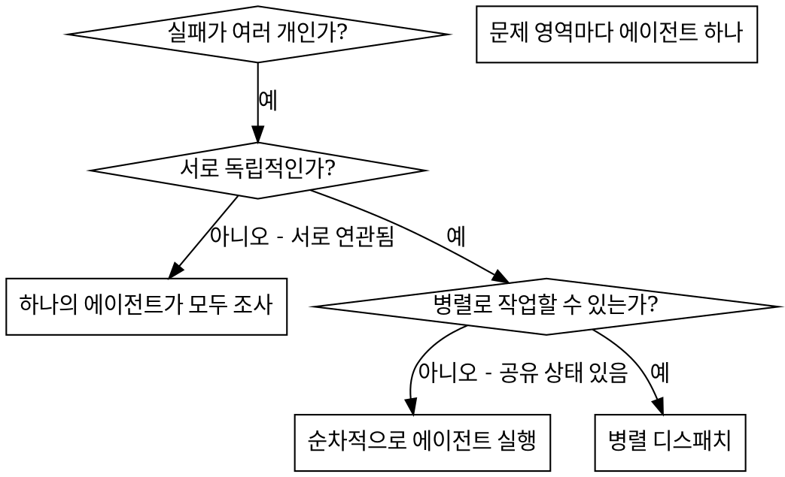

# 병렬 에이전트 디스패치

## 개요

당신은 격리된 컨텍스트를 가진 전문 에이전트들에게 작업을 위임한다. 지시사항과 컨텍스트를 정확하게 구성하면, 각 에이전트가 집중력을 유지한 채 자신의 작업을 성공적으로 수행하게 할 수 있다. 이 에이전트들은 현재 세션의 컨텍스트나 이력을 그대로 물려받아서는 안 되며, 필요한 정보만 당신이 직접 구성해 전달해야 한다. 이렇게 하면 조율 작업을 위한 당신 자신의 컨텍스트도 보존할 수 있다.

서로 무관한 실패가 여러 개 있을 때(서로 다른 테스트 파일, 서로 다른 서브시스템, 서로 다른 버그), 이를 순차적으로 조사하는 것은 시간을 낭비하게 된다. 각 조사는 서로 독립적이며 병렬로 진행할 수 있다.

**핵심 원칙:** 독립적인 문제 영역마다 에이전트를 하나씩 배정하라. 동시에 작업하게 하라.

## 사용 시점



**다음과 같은 경우 사용:**
- 서로 다른 근본 원인으로 3개 이상의 테스트 파일이 실패할 때
- 여러 서브시스템이 서로 독립적으로 망가졌을 때
- 각 문제를 다른 문제의 컨텍스트 없이도 이해할 수 있을 때
- 조사들 사이에 공유 상태가 없을 때

**다음과 같은 경우에는 사용하지 말 것:**
- 실패들이 서로 연관되어 있어 하나를 고치면 다른 것도 해결될 수 있을 때
- 전체 시스템 상태를 함께 이해해야 할 때
- 에이전트들이 서로 간섭하게 될 때

## 패턴

### 1. 독립적인 영역 식별

무엇이 망가졌는지 기준으로 실패를 묶어라:
- 파일 A 테스트: 도구 승인 흐름
- 파일 B 테스트: 배치 완료 동작
- 파일 C 테스트: 중단 기능

각 영역은 서로 독립적이다. 도구 승인 문제를 고쳐도 중단 테스트에는 영향을 주지 않는다.

### 2. 집중된 에이전트 작업 만들기

각 에이전트에는 다음이 주어진다:
- **구체적인 범위:** 하나의 테스트 파일 또는 하나의 서브시스템
- **명확한 목표:** 해당 테스트들을 통과시키기
- **제약사항:** 다른 코드는 변경하지 않기
- **기대 출력:** 무엇을 발견했고 무엇을 수정했는지에 대한 요약

### 3. 병렬로 디스패치

```typescript
// pi / AI 환경에서
todo("agent-tool-abort.test.ts 실패 수정")
todo("batch-completion-behavior.test.ts 실패 수정")
todo("tool-approval-race-conditions.test.ts 실패 수정")
// 세 작업 모두 subagent를 통해 동시에 실행됨
```

### 4. 검토 및 통합

에이전트들이 반환되면:
- 각 요약을 읽는다
- 수정 사항이 충돌하지 않는지 검증한다
- 전체 테스트 스위트를 실행한다
- 모든 변경을 통합한다

## 에이전트 프롬프트 구조

좋은 에이전트 프롬프트의 조건:
1. **집중됨** - 하나의 명확한 문제 영역만 다룬다
2. **자급자족 가능함** - 문제를 이해하는 데 필요한 모든 컨텍스트가 들어 있다
3. **출력이 구체적임** - 에이전트가 무엇을 반환해야 하는지 명확하다

```markdown
src/agents/agent-tool-abort.test.ts 에서 실패하는 3개의 테스트를 수정하라:

1. "partial output capture가 있는 tool abort를 처리해야 함" - 메시지에 'interrupted at'이 들어가야 함
2. "completed와 aborted tool이 섞인 경우를 처리해야 함" - 빠른 툴이 완료되지 않고 중단됨
3. "pendingToolCount를 올바르게 추적해야 함" - 결과 3개를 기대하지만 0개가 나옴

이 문제들은 타이밍/레이스 컨디션 이슈다. 작업은 다음과 같다:

1. 테스트 파일을 읽고 각 테스트가 무엇을 검증하는지 이해한다
2. 근본 원인을 식별한다 - 타이밍 문제인가, 실제 버그인가?
3. 다음 방식으로 수정한다:
   - 임의의 timeout을 이벤트 기반 대기로 교체한다
   - 발견된 경우 abort 구현의 버그를 수정한다
   - 동작이 바뀌었다면 테스트 기대값을 조정한다

timeout만 늘리지 말고, 실제 원인을 찾아라.

반환: 무엇을 발견했고 무엇을 수정했는지 요약.
```

## 흔한 실수

**X 너무 광범위함:** "모든 테스트를 고쳐라" - 에이전트가 길을 잃는다
**V 구체적임:** "agent-tool-abort.test.ts를 고쳐라" - 범위가 집중되어 있다

**X 컨텍스트가 없음:** "레이스 컨디션을 고쳐라" - 어디를 봐야 하는지 모른다
**V 컨텍스트 제공:** 오류 메시지와 테스트 이름을 붙여 넣는다

**X 제약이 없음:** 에이전트가 모든 것을 리팩터링할 수 있다
**V 제약 명시:** "프로덕션 코드는 변경하지 마라" 또는 "테스트만 고쳐라"

**X 출력이 모호함:** "고쳐라" - 무엇이 바뀌었는지 알 수 없다
**V 구체적임:** "근본 원인과 변경 사항 요약을 반환하라"

## 사용하지 말아야 할 때

**연관된 실패들:** 하나를 고치면 다른 것도 해결될 수 있으므로 먼저 함께 조사하라
**전체 컨텍스트 필요:** 이해를 위해 시스템 전체를 봐야 한다
**탐색적 디버깅:** 무엇이 망가졌는지 아직 모른다
**공유 상태:** 에이전트들이 서로 간섭하게 된다(같은 파일 편집, 같은 리소스 사용 등)

## 실제 세션 예시

**상황:** 대규모 리팩터링 후 3개 파일에서 테스트 6개 실패

**실패 내용:**
- agent-tool-abort.test.ts: 3개 실패 (타이밍 이슈)
- batch-completion-behavior.test.ts: 2개 실패 (툴이 실행되지 않음)
- tool-approval-race-conditions.test.ts: 1개 실패 (execution count = 0)

**판단:** abort 로직, batch completion, race condition은 서로 다른 독립 영역이다

**디스패치:**
```
subagent 1 -> agent-tool-abort.test.ts 수정
subagent 2 -> batch-completion-behavior.test.ts 수정
subagent 3 -> tool-approval-race-conditions.test.ts 수정
```

**결과:**
- subagent 1: timeout을 이벤트 기반 대기로 교체
- subagent 2: 이벤트 구조 버그 수정 (threadId 위치가 잘못됨)
- subagent 3: 비동기 툴 실행 완료를 기다리는 대기 추가

**통합:** 모든 수정이 서로 독립적이었고, 충돌이 없었으며, 전체 스위트가 녹색이 되었다

**절약된 시간:** 순차 처리 대비 3개의 문제를 1개의 시간에 해결

## 핵심 이점

1. **병렬화** - 여러 조사가 동시에 진행된다
2. **집중도** - 각 에이전트가 좁은 범위를 맡아 추적할 컨텍스트가 적다
3. **독립성** - 에이전트들이 서로 간섭하지 않는다
4. **속도** - 1개의 시간에 3개의 문제를 해결한다

## 검증

에이전트가 반환된 후:
1. **각 요약 검토** - 무엇이 바뀌었는지 이해한다
2. **충돌 확인** - 에이전트들이 같은 코드를 수정했는가?
3. **전체 스위트 실행** - 모든 수정이 함께 잘 동작하는지 검증한다
4. **스팟 체크** - 에이전트가 체계적인 오류를 만들었을 수 있다

## 실제 효과

디버깅 세션(2025-10-03) 기준:
- 3개 파일에서 6개 실패
- 3개의 에이전트를 병렬로 디스패치
- 모든 조사가 동시에 완료됨
- 모든 수정이 성공적으로 통합됨
- 에이전트 변경 사항 간 충돌 0건
