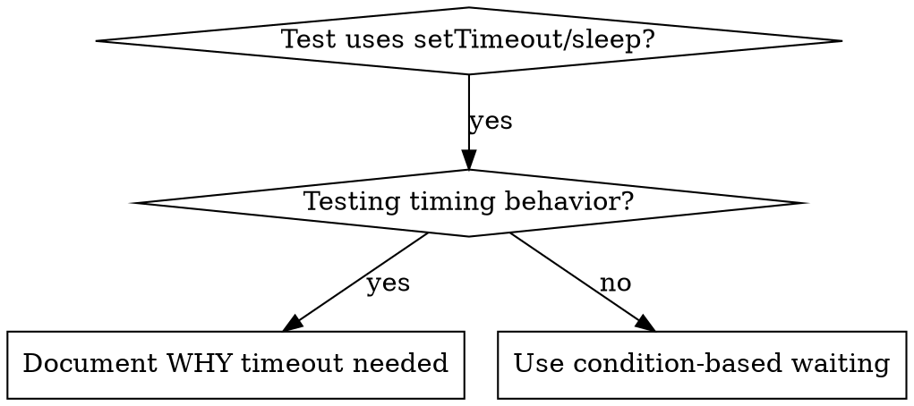

# 조건 기반 대기

## 개요

플레이키 테스트는 종종 임의의 지연 시간으로 타이밍을 추측합니다. 그러면 빠른 환경에서는 통과하지만 부하가 걸리거나 CI에서는 실패하는 레이스 컨디션이 생깁니다.

**핵심 원칙:** 얼마나 걸릴지를 추측해 기다리지 말고, 정말로 확인하려는 조건이 충족될 때까지 기다립니다.

## 언제 사용할까



**이럴 때 사용합니다:**
- 테스트에 임의 지연(`setTimeout`, `sleep`, `time.sleep()`)이 들어가 있다
- 테스트가 플레이키하다(어떤 때는 통과하고, 부하가 걸리면 실패한다)
- 병렬 실행 시 테스트가 타임아웃된다
- 비동기 작업이 끝나기를 기다려야 한다

**이럴 때는 사용하지 않습니다:**
- 실제 타이밍 동작(디바운스, 스로틀 간격)을 검증하는 경우
- 임의 타임아웃을 사용해야 한다면 WHY를 항상 문서화한다

## 핵심 패턴

```typescript
// BAD: Guessing at timing
await new Promise(r => setTimeout(r, 50));
const result = getResult();
expect(result).toBeDefined();

// GOOD: Waiting for condition
await waitFor(() => getResult() !== undefined);
const result = getResult();
expect(result).toBeDefined();
```

## 빠른 패턴 모음

| 상황 | 패턴 |
|----------|---------|
| 이벤트를 기다릴 때 | `waitFor(() => events.find(e => e.type === 'DONE'))` |
| 상태를 기다릴 때 | `waitFor(() => machine.state === 'ready')` |
| 개수를 기다릴 때 | `waitFor(() => items.length >= 5)` |
| 파일을 기다릴 때 | `waitFor(() => fs.existsSync(path))` |
| 복합 조건을 기다릴 때 | `waitFor(() => obj.ready && obj.value > 10)` |

## 구현

범용 폴링 함수:
```typescript
async function waitFor<T>(
  condition: () => T | undefined | null | false,
  description: string,
  timeoutMs = 5000
): Promise<T> {
  const startTime = Date.now();

  while (true) {
    const result = condition();
    if (result) return result;

    if (Date.now() - startTime > timeoutMs) {
      throw new Error(`Timeout waiting for ${description} after ${timeoutMs}ms`);
    }

    await new Promise(r => setTimeout(r, 10)); // Poll every 10ms
  }
}
```

이 디렉터리의 `condition-based-waiting-example.ts`를 보면, 실제 디버깅 세션에서 나온 도메인 특화 헬퍼(`waitForEvent`, `waitForEventCount`, `waitForEventMatch`)를 포함한 전체 구현을 확인할 수 있습니다.

## 자주 하는 실수

**BAD: 너무 빠르게 폴링함:** `setTimeout(check, 1)` - CPU를 낭비함  
**해결:** 10ms 간격으로 폴링한다

**BAD: 타임아웃이 없음:** 조건이 절대 충족되지 않으면 무한 루프에 빠짐  
**해결:** 항상 명확한 에러와 함께 타임아웃을 둔다

**BAD: 오래된 데이터를 봄:** 루프 전에 상태를 캐시함  
**해결:** 항상 최신 데이터를 보도록 루프 안에서 getter를 호출한다

## 임의 타임아웃이 올바른 경우

```typescript
// Tool ticks every 100ms - need 2 ticks to verify partial output
await waitForEvent(manager, 'TOOL_STARTED'); // First: wait for condition
await new Promise(r => setTimeout(r, 200));   // Then: wait for timed behavior
// 200ms = 2 ticks at 100ms intervals - documented and justified
```

**요구사항:**
1. 먼저 트리거 조건이 충족될 때까지 기다린다
2. 추측이 아니라 알려진 타이밍을 기준으로 한다
3. WHY를 설명하는 주석을 남긴다

## 실제 효과

디버깅 세션(2025-10-03) 기준:
- 3개 파일에 걸친 플레이키 테스트 15개 수정
- 통과율: 60% -> 100%
- 실행 시간: 40% 단축
- 더 이상 레이스 컨디션 없음
