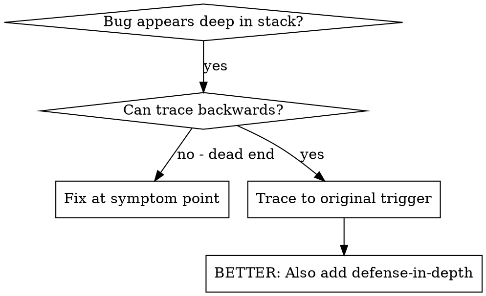
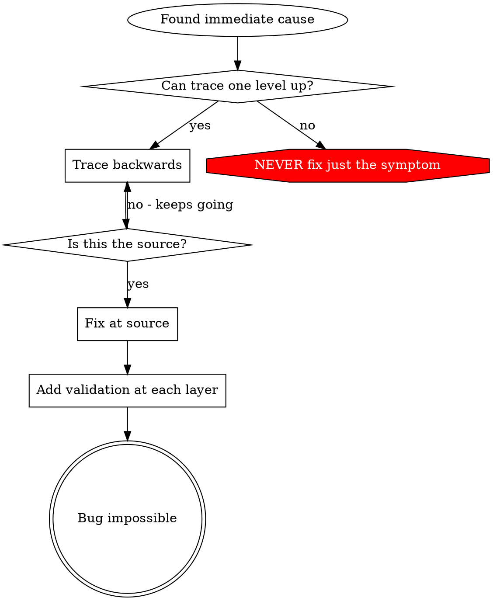

# 근본 원인 추적

## 개요

버그는 종종 호출 스택 깊숙한 곳에서 드러납니다(`git init`이 잘못된 디렉터리에서 실행됨, 파일이 잘못된 위치에 생성됨, 데이터베이스가 잘못된 경로로 열림). 이때 보통은 에러가 드러난 지점을 고치고 싶어지지만, 그것은 증상만 다루는 것입니다.

**핵심 원칙:** 호출 체인을 거슬러 올라가 최초의 트리거를 찾은 뒤, 원인 지점에서 수정합니다.

## 언제 사용할까



**이럴 때 사용합니다:**
- 에러가 실행의 깊은 지점에서 발생한다(진입점이 아니라)
- 스택 트레이스에 긴 호출 체인이 보인다
- 잘못된 데이터가 어디서 시작됐는지 불분명하다
- 어떤 테스트/코드가 문제를 유발하는지 찾아야 한다

## 추적 과정

### 1. 증상을 관찰한다
```
Error: git init failed in /Users/jesse/project/packages/core
```

### 2. 직접적인 원인을 찾는다
**어떤 코드가 이것을 바로 유발하는가?**
```typescript
await execFileAsync('git', ['init'], { cwd: projectDir });
```

### 3. 질문한다: 이것을 누가 호출했는가?
```typescript
WorktreeManager.createSessionWorktree(projectDir, sessionId)
  -> called by Session.initializeWorkspace()
  -> called by Session.create()
  -> called by test at Project.create()
```

### 4. 계속 위로 추적한다
**어떤 값이 전달되었는가?**
- `projectDir = ''` (빈 문자열!)
- `cwd`에 빈 문자열을 주면 `process.cwd()`로 해석된다
- 즉, 소스 코드 디렉터리가 된다!

### 5. 최초 트리거를 찾는다
**빈 문자열은 어디서 왔는가?**
```typescript
const context = setupCoreTest(); // Returns { tempDir: '' }
Project.create('name', context.tempDir); // Accessed before beforeEach!
```

## 스택 트레이스 추가하기

직접 추적하기 어렵다면, 계측 코드를 추가합니다.

```typescript
// Before the problematic operation
async function gitInit(directory: string) {
  const stack = new Error().stack;
  console.error('DEBUG git init:', {
    directory,
    cwd: process.cwd(),
    nodeEnv: process.env.NODE_ENV,
    stack,
  });

  await execFileAsync('git', ['init'], { cwd: directory });
}
```

**중요:** 테스트에서는 `console.error()`를 사용합니다(로거는 출력되지 않을 수 있음)

**실행하고 캡처하기:**
```bash
npm test 2>&1 | grep 'DEBUG git init'
```

**스택 트레이스 분석 포인트:**
- 테스트 파일 이름을 찾는다
- 호출을 유발한 줄 번호를 찾는다
- 패턴을 식별한다(같은 테스트인가? 같은 파라미터인가?)

## 어떤 테스트가 오염을 일으키는지 찾기

테스트 중에 무언가가 생기는데 어느 테스트가 원인인지 모를 때는,

이 디렉터리의 이분 탐색 스크립트 `find-polluter.sh`를 사용합니다.

```bash
./find-polluter.sh '.git' 'src/**/*.test.ts'
```

테스트를 하나씩 실행하다가 처음으로 오염을 일으키는 테스트에서 멈춥니다. 사용법은 스크립트를 참고합니다.

## 실제 예시: 빈 projectDir

**증상:** `packages/core/`(소스 코드)에 `.git`이 생성됨

**추적 체인:**
1. `git init`이 `process.cwd()`에서 실행됨 <- 빈 `cwd` 파라미터
2. WorktreeManager가 빈 `projectDir`로 호출됨
3. Session.create()가 빈 문자열을 전달함
4. 테스트가 `beforeEach` 전에 `context.tempDir`에 접근함
5. setupCoreTest()가 초기에 `{ tempDir: '' }`를 반환함

**근본 원인:** 최상위 변수 초기화에서 빈 값에 접근함

**수정:** `beforeEach` 전에 접근하면 예외를 던지는 getter로 `tempDir`를 바꿈

**방어 심화도 함께 추가함:**
- 1단계: Project.create()가 디렉터리를 검증
- 2단계: WorkspaceManager가 빈 값이 아님을 검증
- 3단계: NODE_ENV 가드가 tmpdir 밖에서의 `git init`을 거부
- 4단계: `git init` 전에 스택 트레이스 로깅

## 핵심 원칙



**절대로 에러가 드러난 지점만 고치지 않습니다.** 반드시 되짚어 올라가 최초의 트리거를 찾습니다.

## 스택 트레이스 팁

**테스트에서:** 로거가 숨겨질 수 있으므로 logger 대신 `console.error()`를 사용한다  
**실행 전:** 실패한 뒤가 아니라, 위험한 작업 전에 로그를 남긴다  
**컨텍스트 포함:** 디렉터리, cwd, 환경 변수, 타임스탬프를 함께 기록한다  
**스택 캡처:** `new Error().stack`으로 전체 호출 체인을 확인한다

## 실제 효과

디버깅 세션(2025-10-03) 기준:
- 5단계 추적으로 근본 원인을 찾아냄
- 원인 지점에서 수정함(getter 검증)
- 4단계 방어층을 추가함
- 테스트 1847개 통과, 오염 0건
