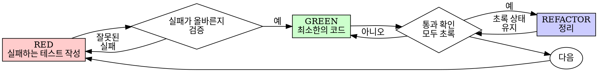

# 테스트 주도 개발(TDD)

## 개요

먼저 테스트를 작성한다. 그 테스트가 실패하는 것을 확인한다. 테스트를 통과시키는 최소한의 코드만 작성한다.

**핵심 원칙:** 테스트가 실제로 실패하는 것을 보지 않았다면, 그 테스트가 올바른 것을 검증하는지 알 수 없다.

**규칙의 문구를 어기는 것은 곧 규칙의 정신을 어기는 것이다.**

## 사용 시점

**항상 사용:**
- 새로운 기능
- 버그 수정
- 리팩터링
- 동작 변경

**예외(반드시 사람 파트너에게 확인):**
- 일회성 프로토타입
- 생성된 코드
- 설정 파일

"이번 한 번만 TDD를 건너뛰자"라고 생각하고 있다면, 멈춰라. 그것은 합리화다.

## 철칙

```
실패하는 테스트 없이는 프로덕션 코드를 작성하지 않는다
```

테스트보다 먼저 코드를 썼는가? 지워라. 처음부터 다시 시작하라.

**예외는 없다:**
- "참고용"으로 남겨두지 마라
- 테스트를 쓰면서 그 코드를 "조정"하지 마라
- 그 코드를 다시 들여다보지도 마라
- 지우라는 말은 정말 지우라는 뜻이다

테스트를 바탕으로 새로 구현하라. 끝.

## 레드-그린-리팩터 사이클



### RED - 실패하는 테스트 작성

일어나야 하는 동작을 보여주는 최소한의 테스트 하나를 작성한다.

<Good>
```typescript
test('실패한 작업을 3번 재시도한다', async () => {
  let attempts = 0;
  const operation = () => {
    attempts++;
    if (attempts < 3) throw new Error('실패');
    return '성공';
  };

  const result = await retryOperation(operation);

  expect(result).toBe('성공');
  expect(attempts).toBe(3);
});
```
이름이 명확하고, 실제 동작을 검증하며, 한 가지만 테스트한다
</Good>

<Bad>
```typescript
test('재시도가 동작한다', async () => {
  const mock = jest.fn()
    .mockRejectedValueOnce(new Error())
    .mockRejectedValueOnce(new Error())
    .mockResolvedValueOnce('성공');
  await retryOperation(mock);
  expect(mock).toHaveBeenCalledTimes(3);
});
```
이름이 모호하고, 코드를 검증하지 않고 목을 검증한다
</Bad>

**요구사항:**
- 동작 하나만 검증한다
- 이름이 명확해야 한다
- 실제 코드를 사용한다(피할 수 없는 경우가 아니면 mock 금지)

### RED 검증 - 실패를 직접 확인하기

**필수다. 절대 건너뛰지 마라.**

```bash
npm test path/to/test.test.ts
```

다음을 확인한다:
- 테스트가 실패한다(에러가 아니라 실패)
- 실패 메시지가 기대한 내용이다
- 오타가 아니라 기능 부재 때문에 실패한다

**테스트가 통과하는가?** 이미 존재하는 동작을 테스트하고 있는 것이다. 테스트를 고쳐라.

**테스트가 에러를 내는가?** 에러를 고치고, 올바르게 실패할 때까지 다시 실행하라.

### GREEN - 최소한의 코드 작성

테스트를 통과시키는 가장 단순한 코드를 작성한다.

<Good>
```typescript
async function retryOperation<T>(fn: () => Promise<T>): Promise<T> {
  for (let i = 0; i < 3; i++) {
    try {
      return await fn();
    } catch (e) {
      if (i === 2) throw e;
    }
  }
  throw new Error('unreachable');
}
```
통과에 필요한 만큼만 작성했다
</Good>

<Bad>
```typescript
async function retryOperation<T>(
  fn: () => Promise<T>,
  options?: {
    maxRetries?: number;
    backoff?: 'linear' | 'exponential';
    onRetry?: (attempt: number) => void;
  }
): Promise<T> {
  // YAGNI
}
```
과도하게 설계되었다
</Bad>

기능을 더하지 말고, 다른 코드를 리팩터링하지 말고, 테스트 범위를 넘어 "개선"하려고도 하지 마라.

### GREEN 검증 - 통과를 직접 확인하기

**필수다.**

```bash
npm test path/to/test.test.ts
```

다음을 확인한다:
- 테스트가 통과한다
- 다른 테스트도 계속 통과한다
- 출력이 깨끗하다(에러, 경고 없음)

**테스트가 실패하는가?** 테스트가 아니라 코드를 고쳐라.

**다른 테스트가 실패하는가?** 지금 바로 고쳐라.

### REFACTOR - 정리하기

초록 상태가 된 뒤에만 한다:
- 중복 제거
- 이름 개선
- 헬퍼 추출

테스트는 계속 초록이어야 한다. 동작은 추가하지 마라.

### 반복

다음 기능을 위해 다음 실패 테스트를 작성한다.

## 좋은 테스트

| 품질 | 좋음 | 나쁨 |
|---------|------|-----|
| **최소성** | 한 가지만 검증한다. 이름에 "그리고"가 들어가면 분리하라. | `test('이메일과 도메인과 공백을 검증한다')` |
| **명확성** | 이름이 동작을 설명한다 | `test('test1')` |
| **의도 표현** | 원하는 API를 드러낸다 | 코드가 무엇을 해야 하는지 흐린다 |

## 왜 순서가 중요한가

**"동작 검증용으로 테스트를 나중에 쓰면 되잖아"**

코드 작성 후에 만든 테스트는 즉시 통과한다. 즉시 통과한다는 사실은 아무것도 증명하지 못한다:
- 잘못된 것을 테스트하고 있을 수 있다
- 동작이 아니라 구현을 테스트하고 있을 수 있다
- 잊어버린 엣지 케이스를 놓칠 수 있다
- 그 테스트가 실제로 버그를 잡는지 한 번도 본 적이 없다

테스트 우선은 테스트가 실제로 실패하는 모습을 보게 강제하고, 그 테스트가 정말 무언가를 검증한다는 증거를 남긴다.

**"엣지 케이스는 이미 전부 수동으로 확인했다"**

수동 테스트는 즉흥적이다. 모든 것을 확인했다고 생각하겠지만:
- 무엇을 테스트했는지 기록이 없다
- 코드가 바뀌었을 때 다시 실행할 수 없다
- 압박을 받으면 케이스를 빼먹기 쉽다
- "내가 해봤을 때는 됐다" ≠ 충분히 포괄적이다

자동화된 테스트는 체계적이다. 매번 같은 방식으로 실행된다.

**"X시간 동안 만든 코드를 지우는 건 낭비다"**

매몰비용 오류다. 그 시간은 이미 지나갔다. 지금 선택지는 두 가지다:
- 지우고 TDD로 다시 작성한다(X시간 추가, 높은 신뢰도)
- 코드를 유지한 채 나중에 테스트를 붙인다(30분, 낮은 신뢰도, 버그 가능성 높음)

진짜 낭비는 신뢰할 수 없는 코드를 붙잡고 있는 것이다. 제대로 된 테스트 없는 동작하는 코드는 기술 부채다.

**"TDD는 교조적이고, 실용적으로 하려면 적응해야 한다"**

TDD야말로 실용적이다:
- 커밋 전에 버그를 찾는다(배포 후 디버깅보다 빠르다)
- 회귀를 막는다(테스트가 깨짐을 즉시 잡아낸다)
- 동작을 문서화한다(테스트가 사용법을 보여준다)
- 리팩터링을 가능하게 한다(자유롭게 바꾸고, 테스트가 깨짐을 잡아낸다)

"실용적"이라는 이름의 지름길은 결국 프로덕션에서 디버깅하게 만들고, 그래서 더 느리다.

**"나중에 쓴 테스트도 목표는 똑같아. 중요한 건 정신이지 형식이 아니야"**

아니다. 사후 테스트는 "이 코드가 지금 무엇을 하나?"에 답한다. 테스트 우선은 "이 코드는 무엇을 해야 하나?"에 답한다.

사후 테스트는 구현에 편향된다. 요구사항이 아니라, 이미 내가 만든 것을 검증하게 된다. 발견한 엣지 케이스가 아니라, 기억나는 엣지 케이스만 확인하게 된다.

테스트 우선은 구현 전에 엣지 케이스를 발견하게 만든다. 사후 테스트는 네가 모든 것을 기억했다고 믿게 만들 뿐이다(실제로는 아니다).

나중에 쓰는 테스트 30분은 TDD와 같지 않다. 커버리지는 얻을 수 있어도, 테스트가 실제로 작동한다는 증거는 잃는다.

## 흔한 합리화

| 변명 | 현실 |
|--------|---------|
| "너무 단순해서 테스트할 필요가 없다" | 단순한 코드도 깨진다. 테스트는 30초면 된다. |
| "나중에 테스트하겠다" | 즉시 통과하는 테스트는 아무것도 증명하지 못한다. |
| "사후 테스트도 같은 목표를 달성한다" | 사후 테스트 = "이 코드가 무엇을 하나?" / 테스트 우선 = "이 코드는 무엇을 해야 하나?" |
| "이미 수동으로 테스트했다" | 즉흥적인 확인은 체계적 검증이 아니다. 기록도 없고, 다시 실행할 수도 없다. |
| "X시간을 지우는 건 낭비다" | 매몰비용 오류다. 검증되지 않은 코드를 유지하는 것이 기술 부채다. |
| "참고용으로 남겨두고, 테스트만 먼저 쓰면 된다" | 결국 그 코드를 참고해 맞춰 쓰게 된다. 그건 사후 테스트다. 지우라는 말은 정말 지우라는 뜻이다. |
| "먼저 탐색이 필요하다" | 좋다. 탐색 결과는 버리고, 그다음 TDD로 시작하라. |
| "테스트가 어렵다는 건 설계가 아직 불명확하다는 뜻이다" | 테스트의 신호를 받아들여라. 테스트하기 어렵다면 사용하기도 어렵다. |
| "TDD는 속도를 늦춘다" | TDD는 디버깅보다 빠르다. 실용적이라는 말의 진짜 의미는 테스트 우선이다. |
| "수동 테스트가 더 빠르다" | 수동 테스트는 엣지 케이스를 증명하지 못한다. 바뀔 때마다 다시 확인해야 한다. |
| "기존 코드에 테스트가 없다" | 지금 그 코드를 개선하고 있는 것이다. 기존 코드에도 테스트를 추가하라. |

## 위험 신호 - 멈추고 처음부터 다시

- 테스트보다 먼저 코드를 작성했다
- 구현 후에 테스트를 추가했다
- 테스트가 즉시 통과한다
- 왜 그 테스트가 실패했는지 설명할 수 없다
- 테스트를 "나중에" 추가했다
- "이번 한 번만"이라고 합리화하고 있다
- "이미 수동으로 테스트했다"
- "사후 테스트도 목적은 같다"
- "형식보다 정신이 중요하다"
- "참고용으로 남기자" 또는 "기존 코드를 조정하자"
- "이미 X시간 썼으니 지우는 건 낭비다"
- "TDD는 교조적이고, 나는 실용적으로 하는 중이다"
- "이번 경우는 다르다, 왜냐하면..."

**이 중 하나라도 해당하면: 코드를 지우고 TDD로 처음부터 다시 시작하라.**

## 예시: 버그 수정

**버그:** 빈 이메일이 허용된다

**RED**
```typescript
test('빈 이메일을 거부한다', async () => {
  const result = await submitForm({ email: '' });
  expect(result.error).toBe('이메일은 필수입니다');
});
```

**Verify RED**
```bash
$ npm test
FAIL: expected '이메일은 필수입니다', got undefined
```

**GREEN**
```typescript
function submitForm(data: FormData) {
  if (!data.email?.trim()) {
    return { error: '이메일은 필수입니다' };
  }
  // ...
}
```

**Verify GREEN**
```bash
$ npm test
PASS
```

**REFACTOR**
필요하다면 여러 필드에 공통으로 쓰이는 검증 로직을 추출한다.

## 검증 체크리스트

작업 완료라고 표시하기 전에:

- [ ] 새로 추가한 모든 함수/메서드에 테스트가 있다
- [ ] 구현 전에 각 테스트가 실패하는 것을 직접 확인했다
- [ ] 각 테스트는 기대한 이유로 실패했다(오타가 아니라 기능 부재)
- [ ] 각 테스트를 통과시키는 최소한의 코드만 작성했다
- [ ] 모든 테스트가 통과한다
- [ ] 출력이 깨끗하다(에러, 경고 없음)
- [ ] 테스트는 실제 코드를 사용한다(mock은 불가피한 경우에만)
- [ ] 엣지 케이스와 오류 상황까지 다뤘다

모든 칸에 체크할 수 없는가? TDD를 건너뛴 것이다. 처음부터 다시 하라.

## 막혔을 때

| 문제 | 해결 방법 |
|---------|----------|
| 어떻게 테스트해야 할지 모르겠다 | 바라던 API를 먼저 적어라. assertion부터 써라. 사람 파트너에게 물어라. |
| 테스트가 너무 복잡하다 | 설계가 너무 복잡하다. 인터페이스를 단순화하라. |
| 전부 mock 처리해야만 한다 | 코드 결합도가 너무 높다. 의존성 주입을 사용하라. |
| 테스트 준비 코드가 너무 많다 | 헬퍼를 추출하라. 그래도 복잡하면 설계를 단순화하라. |

## 디버깅과의 연결

버그를 찾았는가? 그 버그를 재현하는 실패 테스트부터 작성하라. 그다음 TDD 사이클을 따른다. 테스트는 수정이 제대로 되었음을 증명하고, 회귀도 막아준다.

테스트 없이 버그를 고치지 마라.

## 테스트 안티패턴

mock이나 테스트 유틸리티를 추가할 때는 흔한 함정을 피하기 위해 @testing-anti-patterns.md를 읽어라:
- 실제 동작이 아니라 mock의 동작을 테스트하는 문제
- 프로덕션 클래스에 테스트 전용 메서드를 추가하는 문제
- 의존성을 이해하지 못한 채 mock을 사용하는 문제

## 최종 규칙

```
프로덕션 코드 → 그보다 먼저 존재했고 실제로 실패한 테스트가 있다
그 외의 경우 → TDD가 아니다
```

사람 파트너의 허락 없이는 예외가 없다.
