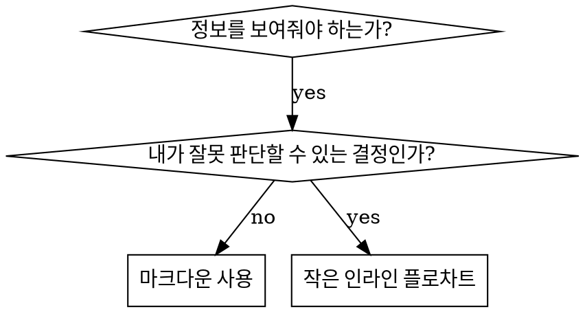

# 스킬 작성하기

## 개요

**스킬 작성은 프로세스 문서화에 적용한 테스트 주도 개발(TDD)이다.**

**개인 스킬은 에이전트별 디렉터리(`~/.claude/skills`는 pi용, `~/.agents/skills/`는 Codex용)에 둔다.** 

테스트 케이스(서브에이전트를 활용한 압박 시나리오)를 만들고, 그것이 실패하는지 확인하고(기본 동작), 스킬을 작성하고(문서화), 테스트가 통과하는지 확인하고(에이전트가 지침을 따름), 리팩터링한다(허점을 막음).

**핵심 원칙:** 스킬 없이 에이전트가 실제로 실패하는 모습을 보지 않았다면, 그 스킬이 올바른 행동을 가르치는지 알 수 없다.

**필수 배경지식:** 이 스킬을 사용하기 전에 반드시 test-driven-development를 이해해야 한다. 그 스킬은 RED-GREEN-REFACTOR의 기본 순환을 정의하고, 이 스킬은 그 TDD를 문서화에 맞게 적용한 것이다.

**공식 가이드:** Anthropic의 공식 스킬 작성 모범 사례는 anthropic-best-practices.md를 참고한다. 이 문서는 이 스킬의 TDD 중심 접근을 보완하는 추가 패턴과 가이드라인을 제공한다.

## 스킬이란 무엇인가?

**스킬**은 검증된 기법, 패턴, 도구를 정리한 참고 가이드다. 스킬은 미래의 pi 인스턴스가 효과적인 접근법을 찾아 적용할 수 있게 돕는다.

**스킬에 해당하는 것:** 재사용 가능한 기법, 패턴, 도구, 참고 가이드

**스킬에 해당하지 않는 것:** 한 번 문제를 해결한 과정을 서술한 이야기

## 스킬에 대응시키는 TDD 개념

| TDD 개념 | 스킬 작성에서의 대응 |
|-------------|----------------|
| **테스트 케이스** | 서브에이전트를 활용한 압박 시나리오 |
| **프로덕션 코드** | 스킬 문서(`SKILL.md`) |
| **테스트 실패(RED)** | 스킬이 없을 때 에이전트가 규칙을 어김(기본 상태) |
| **테스트 통과(GREEN)** | 스킬이 있을 때 에이전트가 지침을 지킴 |
| **리팩터링** | 지침 준수는 유지하면서 허점을 막음 |
| **먼저 테스트 작성** | 스킬을 쓰기 전에 기본 시나리오를 실행 |
| **실패 확인** | 에이전트가 어떤 식으로 합리화하는지 정확히 기록 |
| **최소한의 코드** | 그 구체적 위반을 겨냥한 스킬만 작성 |
| **통과 확인** | 이제 에이전트가 지침을 따르는지 검증 |
| **리팩터링 순환** | 새로운 합리화 발견 → 보강 → 다시 검증 |

스킬 작성의 전체 과정은 RED-GREEN-REFACTOR를 따른다.

## 스킬을 만들어야 하는 때

**다음과 같으면 만든다:**
- 그 기법이 당신에게도 직관적으로 바로 떠오르지 않았다
- 여러 프로젝트에서 다시 참고하게 될 것 같다
- 특정 프로젝트에만 묶이지 않고 넓게 적용되는 패턴이다
- 다른 사람에게도 도움이 된다

**다음과 같으면 만들지 않는다:**
- 일회성 해결책
- 이미 다른 곳에 충분히 문서화된 표준 관행
- 프로젝트 전용 규칙(CLAUDE.md에 둔다)
- 기계적으로 강제할 수 있는 제약(정규식/검증으로 강제 가능하면 자동화하고, 문서는 판단이 필요한 경우에만 쓴다)

## 스킬 유형

### 기법
따라야 할 단계가 있는 구체적 방법(condition-based-waiting, root-cause-tracing)

### 패턴
문제를 바라보는 사고방식(flatten-with-flags, test-invariants)

### 참고자료
API 문서, 문법 가이드, 도구 문서(office docs)

## 디렉터리 구조


```
skills/
  skill-name/
    SKILL.md              # 메인 참고 문서(필수)
    supporting-file.*     # 필요할 때만 추가
```

**평평한 네임스페이스** - 모든 스킬을 하나의 검색 가능한 네임스페이스에 둔다

**파일을 분리해야 하는 경우:**
1. **무거운 참고자료** (100줄 이상) - API 문서, 포괄적인 문법 설명
2. **재사용 가능한 도구** - 스크립트, 유틸리티, 템플릿

**인라인으로 유지할 것:**
- 원칙과 개념
- 코드 패턴(< 50줄)
- 그 외 대부분의 내용

## SKILL.md 구조

**프런트매터(YAML):**
- 필수 필드는 `name`과 `description` 두 개다(지원되는 전체 필드는 [agentskills.io/specification](https://agentskills.io/specification) 참고)
- 전체 길이는 최대 1024자
- `name`: 영문자, 숫자, 하이픈만 사용한다(괄호, 특수문자 금지)
- `description`: 3인칭으로 쓰고, **언제 사용해야 하는지만** 설명한다(무엇을 하는지는 쓰지 않는다)
  - 트리거 조건에 집중할 수 있도록 "Use when..."이 아니라 자연스러운 한국어의 "...할 때 사용한다" 형태로 시작한다
  - 구체적인 증상, 상황, 맥락을 포함한다
  - **스킬의 과정이나 워크플로를 절대 요약하지 않는다**(이유는 아래 CSO 섹션 참고)
  - 가능하면 500자 이내로 유지한다

```markdown
---
name: Skill-Name-With-Hyphens
description: [구체적인 트리거 조건과 증상이 있을 때 사용한다]
---

# 스킬 이름

## 개요
이것이 무엇인지와 핵심 원칙을 1~2문장으로 설명한다.

## 사용해야 하는 때
[판단이 모호할 때만 작은 인라인 플로차트를 넣는다]

증상과 사용 사례를 담은 불릿 목록
사용하면 안 되는 경우

## 핵심 패턴(기법/패턴형 스킬)
변경 전/후 코드 비교

## 빠른 참고
자주 하는 작업을 빠르게 훑을 수 있는 표나 불릿

## 구현
단순한 패턴은 인라인 코드로 작성
무거운 참고자료나 재사용 도구는 파일 링크로 연결

## 흔한 실수
무엇이 잘못되는지와 어떻게 고치는지

## 실제 효과(선택 사항)
구체적인 결과
```


## 검색 최적화(CSO)

**발견 가능성에서 매우 중요:** 미래의 pi가 당신의 스킬을 반드시 찾아야 한다

### 1. 풍부한 description 필드

**목적:** pi는 어떤 작업에서 어떤 스킬을 읽을지 결정하기 위해 description을 읽는다. 이 필드는 “지금 이 스킬을 읽어야 하나?”라는 질문에 답해야 한다.

**형식:** 트리거 조건에 집중할 수 있도록 "Use when..." 대신 자연스러운 한국어의 "...할 때 사용한다" 형태로 시작한다

**중요: description은 언제 써야 하는지여야 하며, 스킬이 무엇을 하는지 설명하면 안 된다**

description은 오직 트리거 조건만 설명해야 한다. 스킬의 과정이나 워크플로를 description에 요약하지 마라.

**왜 중요한가:** 테스트 결과, description이 스킬의 워크플로를 요약하면 pi가 전체 스킬 내용을 읽지 않고 description만 따를 수 있었다. 예를 들어 “작업 사이에 코드 리뷰를 수행한다” 같은 설명이 있으면, 스킬의 플로차트에 리뷰 2단계(명세 준수 → 코드 품질)가 분명히 있어도 pi는 리뷰를 한 번만 수행했다.

description을 단순히 “독립적인 작업이 있는 구현 계획을 현재 세션에서 실행해야 할 때 사용한다”처럼 바꾸자(워크플로 요약 없음), pi는 플로차트를 제대로 읽고 2단계 리뷰 절차를 올바르게 따랐다.

**함정:** 워크플로를 요약한 description은 pi가 곧바로 지름길로 삼는다. 그러면 스킬 본문은 읽히지 않는 문서가 된다.

```yaml
# 나쁨: 워크플로를 요약함 - pi가 스킬 대신 이것만 따를 수 있음
description: 계획을 실행할 때 사용한다. 각 작업마다 서브에이전트를 보내고 작업 사이에 코드 리뷰를 한다.

# 나쁨: 과정 설명이 너무 많음
description: TDD를 할 때 사용한다. 먼저 테스트를 쓰고, 실패를 확인하고, 최소한의 코드를 쓰고, 리팩터링한다.

# 좋음: 트리거 조건만 있고 워크플로 요약이 없음
description: 독립적인 작업들로 이루어진 구현 계획을 현재 세션에서 실행해야 할 때 사용한다.

# 좋음: 트리거 조건만 설명함
description: 기능 추가나 버그 수정을 구현 코드보다 먼저 테스트 우선 방식으로 진행해야 할 때 사용한다.
```

**내용 가이드:**
- 이 스킬이 적용된다는 신호가 되는 구체적인 트리거, 증상, 상황을 사용한다
- *언어별 증상*(`setTimeout`, `sleep`)이 아니라 *문제 자체*(경쟁 상태, 일관되지 않은 동작)를 설명한다
- 스킬 자체가 특정 기술 전용이 아닌 이상, 트리거는 기술 중립적으로 쓴다
- 기술 전용 스킬이라면, 그 사실을 트리거에 명확히 드러낸다
- 3인칭으로 작성한다(시스템 프롬프트에 주입되기 때문)
- **스킬의 과정이나 워크플로를 절대 요약하지 않는다**

```yaml
# 나쁨: 너무 추상적이고 모호하며, 언제 써야 하는지 드러나지 않음
description: 비동기 테스트용

# 나쁨: 1인칭 사용
description: 비동기 테스트가 불안정할 때 내가 도와줄 수 있다

# 나쁨: 스킬이 특정 기술 전용이 아닌데 기술명을 넣음
description: 테스트에서 setTimeout/sleep을 쓰고 있고 플래키할 때 사용한다.

# 좋음: "Use when" 대신 자연스러운 한국어로 문제를 설명하고, 워크플로는 넣지 않음
description: 테스트에 경쟁 상태나 타이밍 의존성이 있거나, 통과와 실패가 일관되지 않을 때 사용한다.

# 좋음: 기술 전용 스킬이며 트리거가 명확함
description: React Router를 사용하면서 인증 리다이렉트를 처리해야 할 때 사용한다.
```

### 2. 키워드 포괄성

pi가 실제로 검색할 법한 단어를 사용한다.
- 오류 메시지: "Hook timed out", "ENOTEMPTY", "race condition"
- 증상: "flaky", "hanging", "zombie", "pollution"
- 동의어: "timeout/hang/freeze", "cleanup/teardown/afterEach"
- 도구: 실제 명령어, 라이브러리 이름, 파일 형식

### 3. 설명적인 이름

**능동태, 동사 우선으로 쓴다:**
- `skill-creation`보다 `creating-skills`
- `async-test-helpers`보다 `condition-based-waiting`

### 4. 토큰 효율성(매우 중요)

**문제:** 자주 참조되는 스킬은 로드될 때 토큰을 소비한다. 모든 토큰이 중요하다.

**목표 단어 수:**
- 시작용 워크플로: 각각 150단어 미만
- 자주 로드되는 스킬: 총 200단어 미만
- 기타 스킬: 500단어 미만으로 유지(그래도 간결해야 함)

**기법:**

**상세 내용은 도구 도움말로 옮긴다:**
```bash
# 나쁨: SKILL.md에 모든 플래그를 다 적음
search-conversations supports --text, --both, --after DATE, --before DATE, --limit N

# 좋음: --help를 참조시킴
search-conversations supports multiple modes and filters. Run --help for details.
```

**교차 참조를 활용한다:**
```markdown
# 나쁨: 워크플로 상세를 반복함
검색할 때는 템플릿과 함께 서브에이전트를 보내고...
[중복된 지시 20줄]

# 좋음: 다른 스킬을 참조함
서브에이전트는 항상 사용한다(컨텍스트 50~100배 절약). **필수:** 워크플로는 [other-skill-name]을 사용한다.
```

**예시는 압축한다:**
```markdown
# 나쁨: 장황한 예시(42단어)
당신의 인간 협업자: "예전에 React Router에서 인증 에러를 어떻게 처리했지?"
당신: 과거 대화에서 React Router 인증 패턴을 검색해볼게요.
[검색어 "React Router authentication error handling 401"로 서브에이전트 호출]

# 좋음: 간결한 예시(20단어)
협업자: "React Router 인증 에러 어떻게 처리했지?"
당신: 검색해볼게요...
[서브에이전트 호출 -> 종합]
```

**중복은 제거한다:**
- 다른 스킬에 이미 있는 내용을 반복하지 않는다
- 명령어만 봐도 분명한 것은 굳이 설명하지 않는다
- 같은 패턴 예시를 여러 개 넣지 않는다

**검증:**
```bash
wc -w skills/path/SKILL.md
# 시작용 워크플로는 각각 150단어 미만을 목표로 한다
# 그 외 자주 로드되는 스킬은 총 200단어 미만을 목표로 한다
```

**이름은 내가 무엇을 하는지, 또는 핵심 통찰이 무엇인지 기준으로 짓는다:**
- `async-test-helpers`보다 `condition-based-waiting`
- `skill-usage`보다 `using-skills`
- `data-structure-refactoring`보다 `flatten-with-flags`
- `debugging-techniques`보다 `root-cause-tracing`

**과정을 나타낼 때는 동명사(-ing)가 잘 맞는다:**
- `creating-skills`, `testing-skills`, `debugging-with-logs`
- 동작이 살아 있고, 지금 수행하는 행동을 잘 설명한다

### 4. 다른 스킬과 교차 참조하기

**다른 스킬을 참조하는 문서를 쓸 때:**

스킬 이름만 쓰고, 명시적인 요구 표시를 붙인다.
- 좋음: `**필수 하위 스킬:** test-driven-development를 사용한다`
- 좋음: `**필수 배경지식:** systematic-debugging를 반드시 이해해야 한다`
- 나쁨: `See skills/testing/test-driven-development` (필수인지 불명확함)
- 나쁨: `@skills/testing/test-driven-development/SKILL.md` (즉시 강제 로드되어 컨텍스트를 낭비함)

**왜 @ 링크를 쓰지 않는가:** `@` 문법은 파일을 즉시 강제로 불러오므로, 실제로 필요해지기 전에 200k+ 이상의 컨텍스트를 써버린다.

## 플로차트 사용



**플로차트를 써야 하는 경우만 사용한다:**
- 판단이 직관적이지 않은 지점
- 너무 일찍 멈추기 쉬운 반복 과정
- “A를 써야 하나 B를 써야 하나” 같은 선택

**다음에는 플로차트를 쓰지 않는다:**
- 참고자료 -> 표, 목록
- 코드 예시 -> 마크다운 코드 블록
- 선형 지시 -> 번호 목록
- 의미 없는 라벨(step1, helper2)

Graphviz 스타일 규칙은 @graphviz-conventions.dot를 참고한다.

**인간 협업자에게 시각화해서 보여주기:** 이 디렉터리의 `render-graphs.js`를 사용하면 스킬의 플로차트를 SVG로 렌더링할 수 있다.
```bash
./render-graphs.js ../some-skill           # 각 다이어그램을 개별 SVG로 렌더링
./render-graphs.js ../some-skill --combine # 모든 다이어그램을 하나의 SVG로 렌더링
```

## 코드 예시

**평범한 예시 여러 개보다 훌륭한 예시 하나가 낫다**

가장 적절한 언어를 고른다.
- 테스트 기법 -> TypeScript/JavaScript
- 시스템 디버깅 -> Shell/Python
- 데이터 처리 -> Python

**좋은 예시의 기준:**
- 완전하고 실행 가능하다
- 왜 그런지 설명하는 주석이 잘 달려 있다
- 실제 시나리오에서 나왔다
- 패턴이 분명하게 드러난다
- 일반 템플릿이 아니라 바로 응용할 수 있다

**하지 말아야 할 것:**
- 5개 이상의 언어로 구현하기
- 빈칸만 채우는 템플릿 만들기
- 억지로 만든 예시 쓰기

당신은 포팅을 잘한다. 훌륭한 예시 하나면 충분하다.

## 파일 구성

### 자기완결형 스킬
```
defense-in-depth/
  SKILL.md    # 모든 내용을 인라인으로 포함
```
내용이 모두 들어가고, 무거운 참고자료가 필요 없을 때

### 재사용 가능한 도구를 포함한 스킬
```
condition-based-waiting/
  SKILL.md    # 개요 + 패턴
  example.ts  # 바로 응용할 수 있는 동작하는 헬퍼
```
도구가 단순한 설명이 아니라 재사용 가능한 코드일 때

### 무거운 참고자료를 포함한 스킬
```
pptx/
  SKILL.md       # 개요 + 워크플로
  pptxgenjs.md   # 600줄짜리 API 참고자료
  ooxml.md       # 500줄짜리 XML 구조 설명
  scripts/       # 실행 가능한 도구
```
참고자료가 너무 커서 인라인으로 넣기 어려울 때

## 철칙(TDD와 동일)

```
NO SKILL WITHOUT A FAILING TEST FIRST
```

이 원칙은 새로운 스킬에도, 기존 스킬 수정에도 똑같이 적용된다.

테스트보다 먼저 스킬을 썼는가? 삭제하고 처음부터 다시 시작한다.
테스트 없이 스킬을 수정했는가? 같은 위반이다.

**예외는 없다:**
- “간단한 추가”라고 해도 안 된다
- “섹션 하나만 더하는 것”도 안 된다
- “문서 업데이트”도 안 된다
- 테스트되지 않은 변경을 “참고용”으로 남기지 않는다
- 테스트를 돌리면서 동시에 “조정”하지 않는다
- 삭제하라는 말은 정말 삭제하라는 뜻이다

**필수 배경지식:** 왜 이것이 중요한지는 test-driven-development 스킬이 설명한다. 같은 원칙이 문서에도 그대로 적용된다.

## 모든 스킬 유형 테스트하기

스킬 유형마다 테스트 접근법이 다르다.

### 규율을 강제하는 스킬(규칙/요구사항)

**예시:** TDD, verification-before-completion, designing-before-coding

**이렇게 테스트한다:**
- 학술적 질문: 규칙 자체를 이해하는가?
- 압박 시나리오: 압박이 있어도 지키는가?
- 여러 압박의 결합: 시간 + 매몰비용 + 피로
- 합리화를 찾아내고, 이를 막는 문구를 명시적으로 추가한다

**성공 기준:** 최대 압박 상황에서도 에이전트가 규칙을 지킨다

### 기법형 스킬(방법 안내)

**예시:** condition-based-waiting, root-cause-tracing, defensive-programming

**이렇게 테스트한다:**
- 적용 시나리오: 기법을 올바르게 적용하는가?
- 변형 시나리오: 엣지 케이스를 처리하는가?
- 정보 누락 테스트: 지침에 빈틈은 없는가?

**성공 기준:** 에이전트가 새로운 시나리오에도 기법을 성공적으로 적용한다

### 패턴형 스킬(사고 모델)

**예시:** reducing-complexity, information-hiding concepts

**이렇게 테스트한다:**
- 인식 시나리오: 이 패턴이 적용되는 순간을 알아보는가?
- 적용 시나리오: 그 사고 모델을 실제로 쓸 수 있는가?
- 반례: 언제 적용하면 안 되는지도 아는가?

**성공 기준:** 에이전트가 언제/어떻게 패턴을 적용해야 하는지 올바르게 판단한다

### 참고형 스킬(문서/API)

**예시:** API 문서, 명령어 레퍼런스, 라이브러리 가이드

**이렇게 테스트한다:**
- 정보 검색 시나리오: 필요한 정보를 제대로 찾는가?
- 적용 시나리오: 찾은 정보를 올바르게 사용하는가?
- 공백 테스트: 흔한 사용 사례가 빠지지 않았는가?

**성공 기준:** 에이전트가 참고 정보를 찾아 정확하게 적용한다

## 테스트를 건너뛰려는 흔한 합리화

| 핑계 | 현실 |
|--------|---------|
| "스킬이 너무 명확하다" | 당신에게 명확한 것과 다른 에이전트에게 명확한 것은 다르다. 테스트하라. |
| "그냥 참고자료일 뿐이다" | 참고자료에도 빈틈과 모호한 부분이 있을 수 있다. 검색과 적용을 테스트하라. |
| "테스트는 과하다" | 테스트하지 않은 스킬에는 늘 문제가 있다. 15분 테스트가 몇 시간을 아낀다. |
| "문제가 생기면 그때 테스트하겠다" | 문제가 생긴다는 건 에이전트가 스킬을 못 쓴다는 뜻이다. 배포 전에 테스트하라. |
| "테스트가 너무 번거롭다" | 운영에서 망가진 스킬을 디버깅하는 쪽이 더 번거롭다. |
| "잘 만들었다는 확신이 있다" | 과도한 자신감은 문제를 보장한다. 그래도 테스트하라. |
| "이론 검토만으로 충분하다" | 읽는 것과 실제로 쓰는 것은 다르다. 적용 시나리오를 테스트하라. |
| "테스트할 시간이 없다" | 테스트 안 한 스킬을 배포하면 나중에 고치느라 더 많은 시간을 잃는다. |

**이 모든 핑계가 뜻하는 바는 하나다: 배포 전에 테스트하라. 예외는 없다.**

## 합리화에 흔들리지 않게 스킬을 단단하게 만들기

TDD 같은 규율형 스킬은 합리화에 버틸 수 있어야 한다. 에이전트는 똑똑하기 때문에, 압박을 받으면 허점을 찾아낸다.

**심리학 메모:** 설득 기법이 왜 작동하는지 이해하면 그것을 더 체계적으로 적용할 수 있다. 권위, 헌신, 희소성, 사회적 증거, 동일시 원리에 대한 연구 기반은 persuasion-principles.md(Cialdini, 2021; Meincke et al., 2025)를 참고한다.

### 모든 허점을 명시적으로 막아라

규칙만 선언하지 말고, 구체적인 우회 방법까지 금지하라.

<Bad>
```markdown
테스트보다 먼저 코드를 썼는가? 삭제하라.
```
</Bad>

<Good>
```markdown
테스트보다 먼저 코드를 썼는가? 삭제하라. 처음부터 다시 시작한다.

**예외는 없다:**
- "참고용"으로 남기지 않는다
- 테스트를 쓰면서 동시에 "조정"하지 않는다
- 들여다보지도 않는다
- 삭제하라는 말은 정말 삭제하라는 뜻이다
```
</Good>

### “정신은 지켰고 문자만 어겼다”는 주장에 대응하라

초반에 다음과 같은 기초 원칙을 넣는다.

```markdown
**규칙의 문자를 어기는 것은 규칙의 정신을 어기는 것과 같다.**
```

이 문장은 “정신만 지키면 된다”는 부류의 합리화를 한꺼번에 차단한다.

### 합리화 표를 구축하라

기본 테스트에서 나온 합리화를 모두 표에 담는다(아래 테스트 섹션 참고). 에이전트가 내놓은 모든 핑계는 이 표로 들어가야 한다.

```markdown
| 핑계 | 현실 |
|--------|---------|
| "테스트하기엔 너무 단순하다" | 단순한 코드도 망가진다. 테스트는 30초면 된다. |
| "나중에 테스트하면 된다" | 나중에 테스트가 통과한다고 해서 처음부터 의도가 맞았다는 뜻은 아니다. |
| "나중에 쓰는 테스트도 같은 목표를 달성한다" | 사후 테스트는 "이 코드가 뭘 하지?"이고, 선행 테스트는 "이 코드는 무엇을 해야 하지?"이다. |
```

### 레드 플래그 목록을 만들어라

에이전트가 스스로 합리화 중인지 점검하기 쉽게 만든다.

```markdown
## 레드 플래그 - 멈추고 처음부터 다시 시작

- 테스트보다 먼저 코드 작성
- "이미 수동으로 테스트했다"
- "사후 테스트도 같은 목적을 달성한다"
- "의식이 아니라 정신의 문제다"
- "이번 경우는 다르다..."

**이런 신호가 보이면 모두 같은 뜻이다: 코드를 삭제하고 TDD로 다시 시작한다.**
```

### 위반 징후를 CSO에 반영하라

description에는 규칙을 막 어기려는 순간의 증상도 넣는다.

```yaml
description: 기능 추가나 버그 수정을 구현 코드보다 먼저 테스트 우선 방식으로 진행해야 할 때 사용한다.
```

## 스킬을 위한 RED-GREEN-REFACTOR

TDD 순환을 그대로 따른다.

### RED: 실패하는 테스트 작성(기본 상태 확인)

스킬 없이 서브에이전트에게 압박 시나리오를 실행한다. 그리고 정확한 동작을 기록한다.
- 어떤 선택을 했는가?
- 어떤 식으로 합리화했는가(가능하면 원문 그대로)?
- 어떤 압박이 위반을 유발했는가?

이것이 바로 “실패를 확인한다”는 뜻이다. 스킬을 쓰기 전에 에이전트가 원래 어떻게 행동하는지 반드시 봐야 한다.

### GREEN: 최소한의 스킬 작성

방금 확인한 구체적인 합리화를 겨냥하는 스킬만 작성한다. 가상의 경우까지 미리 넣지 않는다.

같은 시나리오를 스킬이 있는 상태로 다시 실행한다. 이제 에이전트가 지침을 따라야 한다.

### REFACTOR: 허점 막기

에이전트가 새로운 합리화를 내놨는가? 그에 대한 명시적 대응을 추가한다. 흔들리지 않을 때까지 다시 테스트한다.

**테스트 방법론:** 전체 테스트 방법은 @testing-skills-with-subagents.md를 참고한다.
- 압박 시나리오를 작성하는 법
- 압박의 종류(시간, 매몰비용, 권위, 피로)
- 허점을 체계적으로 막는 법
- 메타 테스트 기법

## 안티패턴

### 나쁨: 서사형 예시
"2025-10-03 세션에서 empty projectDir가 원인이었다..."
**왜 나쁜가:** 너무 구체적이라 재사용할 수 없다

### 나쁨: 다중 언어로 희석됨
example-js.js, example-py.py, example-go.go
**왜 나쁜가:** 품질이 평범해지고 유지 비용이 커진다

### 나쁨: 플로차트 안에 코드 넣기
```dot
step1 [label="import fs"];
step2 [label="read file"];
```
**왜 나쁜가:** 복사해서 쓸 수 없고 읽기도 어렵다

### 나쁨: 의미 없는 일반 라벨
helper1, helper2, step3, pattern4
**왜 나쁜가:** 라벨에는 의미가 있어야 한다

## 중지: 다음 스킬로 넘어가기 전에

**어떤 스킬이든 하나 작성했다면 반드시 멈추고 배포 과정을 끝까지 완료해야 한다.**

**하지 말아야 할 것:**
- 각 스킬을 테스트하지 않은 채 여러 스킬을 한꺼번에 만들기
- 현재 스킬 검증이 끝나기 전에 다음 스킬로 넘어가기
- “묶어서 하면 더 효율적이니까”라며 테스트를 건너뛰기

**아래 배포 체크리스트는 각 스킬마다 반드시 수행해야 한다.**

테스트하지 않은 스킬을 배포하는 것은 테스트하지 않은 코드를 배포하는 것과 같다. 품질 기준 위반이다.

## 스킬 작성 체크리스트(TDD 적용)

**중요: 아래 각 항목마다 `todo` 도구로 할 일을 만들어라.**

**RED 단계 - 실패하는 테스트 작성:**
- [ ] 압박 시나리오를 만든다(규율형 스킬은 3개 이상의 압박을 결합)
- [ ] 스킬 없이 시나리오를 실행하고, 기본 동작을 가능한 한 원문 그대로 기록한다
- [ ] 합리화와 실패 패턴을 식별한다

**GREEN 단계 - 최소한의 스킬 작성:**
- [ ] 이름은 영문자, 숫자, 하이픈만 사용한다(괄호/특수문자 금지)
- [ ] 필수 `name`, `description` 필드를 갖춘 YAML 프런트매터가 있다(최대 1024자, [spec](https://agentskills.io/specification) 참고)
- [ ] description은 "Use when..." 대신 자연스러운 한국어의 "...할 때 사용한다" 형태로 시작하고, 구체적인 트리거/증상을 포함한다
- [ ] description을 3인칭으로 작성했다
- [ ] 검색을 위한 키워드가 문서 전체에 있다(오류, 증상, 도구)
- [ ] 핵심 원칙이 드러나는 명확한 개요가 있다
- [ ] RED 단계에서 확인한 구체적 실패를 다룬다
- [ ] 코드는 인라인으로 넣거나 별도 파일로 연결한다
- [ ] 여러 언어 예시 대신 훌륭한 예시 하나가 있다
- [ ] 스킬이 있는 상태로 시나리오를 실행해, 이제 에이전트가 지침을 따르는지 검증한다

**REFACTOR 단계 - 허점 막기:**
- [ ] 테스트에서 드러난 새로운 합리화를 식별한다
- [ ] 명시적 대응을 추가한다(규율형 스킬인 경우)
- [ ] 모든 테스트 반복에서 나온 합리화를 표로 정리한다
- [ ] 레드 플래그 목록을 만든다
- [ ] 흔들리지 않을 때까지 다시 테스트한다

**품질 점검:**
- [ ] 판단이 모호할 때만 작은 플로차트를 넣는다
- [ ] 빠른 참고용 표가 있다
- [ ] 흔한 실수 섹션이 있다
- [ ] 서사형 스토리텔링이 없다
- [ ] 보조 파일은 도구나 무거운 참고자료일 때만 둔다

**배포:**
- [ ] 스킬을 git에 커밋하고 포크에 푸시한다(설정되어 있다면)
- [ ] 널리 유용하다면 PR로 기여하는 것도 고려한다

## 발견 워크플로

미래의 pi가 당신의 스킬을 찾는 방식은 다음과 같다.

1. **문제를 만난다** ("테스트가 flaky하다")
3. **SKILL을 찾는다** (description이 맞아떨어진다)
4. **개요를 훑는다** (관련 있는가?)
5. **패턴을 읽는다** (빠른 참고 표)
6. **예시를 불러온다** (구현할 때만)

**이 흐름에 맞게 최적화하라** - 검색 가능한 단어를 앞쪽에, 그리고 자주 배치한다.

## 핵심 정리

**스킬 작성은 프로세스 문서화를 위한 TDD다.**

철칙도 같다. 실패하는 테스트 없이 스킬은 없다.
순환도 같다. RED(기본 상태) -> GREEN(스킬 작성) -> REFACTOR(허점 막기).
이점도 같다. 더 높은 품질, 더 적은 놀라움, 더 단단한 결과.

코드에 TDD를 적용한다면, 스킬에도 적용하라. 같은 규율을 문서에 적용하는 것일 뿐이다.
